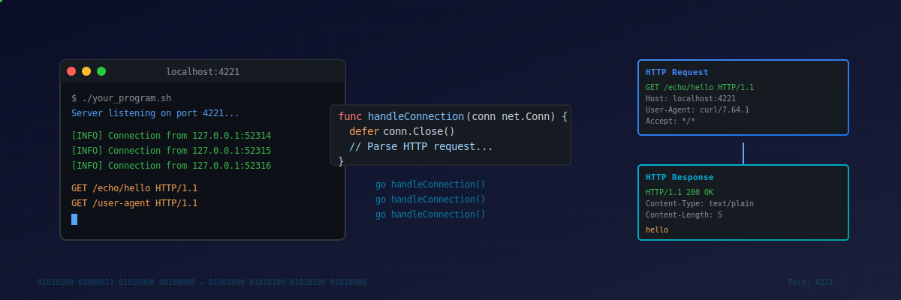

<p align="center">
  
</p>
<h1 align="center"><i>Port Authority</i></h1>

<p align="center">
  <a href="https://golang.org"></a>
  <a href="https://app.codecrafters.io"></a>
  <a href="https://en.wikipedia.org/wiki/HTTP"></a>
</p>

## Overview

**Completion:** 

A custom HTTP/1.1 server implementation in Go, built as part of the [CodeCrafters "Build Your Own HTTP Server"](https://app.codecrafters.io/courses/http-server/overview) challenge. This server implements the HTTP protocol from scratch, handling TCP connections, parsing HTTP requests, and serving multiple concurrent clients.

## Features

- **TCP Server**: Raw TCP socket handling with concurrent connection support
- **HTTP/1.1 Protocol**: Request parsing and response building from scratch
- **Concurrent Connections**: Goroutine-based architecture for handling multiple clients
- **Modular Design**: Clean separation of concerns with parser, response, router, and logger packages
- **Progressive Implementation**: Built stage-by-stage following CodeCrafters challenges

## Tech Stack

- **Go 1.24** - Core language
- **Standard Library Only** - No external HTTP frameworks (implementing HTTP from scratch)
- **TCP Sockets** - Direct network programming with `net` package

## Requirements

- Go 1.24 or higher
- Port 4221 available for binding

## Installation

1. Clone the repository:
```bash
git clone [your-repo-url]
cd codecrafters-http-server-go
```

2. Build the server:
```bash
go build -o http-server app/*.go
```

## Usage

### Running the Server

Using the provided script:
```bash
./your_program.sh
```

Or directly with Go:
```bash
go run app/main.go
```

The server will start listening on port 4221.

### Testing the Server

Send HTTP requests using curl:
```bash
# Test root endpoint
curl http://localhost:4221/

# Test other paths
curl http://localhost:4221/echo/hello
curl http://localhost:4221/user-agent
```

## Project Structure

```
codecrafters-http-server-go/
├── app/
│   ├── main.go           # Server entry point and connection handling
│   ├── parser/
│   │   └── parser.go     # HTTP request parsing
│   ├── response/
│   │   └── response.go   # HTTP response building
│   ├── router/
│   │   └── router.go     # Request routing (to be implemented)
│   └── logger/
│       └── logger.go     # Logging utilities (to be implemented)
├── your_program.sh       # Build and run script
├── codecrafters.yml      # CodeCrafters configuration
├── go.mod
├── go.sum
├── CLAUDE.md             # AI assistant guidance
└── README.md
```

## Development

### Building

```bash
# Build the binary
go build -o /tmp/codecrafters-build-http-server-go app/*.go

# Run the binary
/tmp/codecrafters-build-http-server-go
```

### Submitting Solutions

Each stage of the challenge is submitted via git:
```bash
git commit -am "pass stage X"
git push origin master
```

CodeCrafters will automatically test your implementation and provide feedback.

## Implementation Status

### Completed
- [x] TCP server setup and binding to port 4221
- [x] Concurrent connection handling with goroutines
- [x] Basic request reading infrastructure

### In Progress
- [ ] HTTP request parsing (needs struct definition)
- [ ] HTTP response building (needs completion)

### To Do
- [ ] Request routing
- [ ] Path parameter extraction
- [ ] Request headers parsing
- [ ] Response headers
- [ ] File serving
- [ ] Compression support

## Learning Resources

- [HTTP/1.1 Specification (RFC 2616)](https://www.w3.org/Protocols/rfc2616/rfc2616.html)
- [HTTP Request Syntax](https://www.w3.org/Protocols/rfc2616/rfc2616-sec5.html)
- [CodeCrafters HTTP Server Challenge](https://app.codecrafters.io/courses/http-server/overview)

## Notes

- This is an educational project focused on understanding HTTP internals
- The server implements HTTP/1.1 from scratch without using Go's built-in HTTP server
- Each connection is handled in its own goroutine for concurrency
- The implementation follows CodeCrafters stages progressively

## License

MIT - See [LICENSE](./LICENSE) for details

## Author

[Michael Monaghan](mailto:michael@monaghan.nyc)